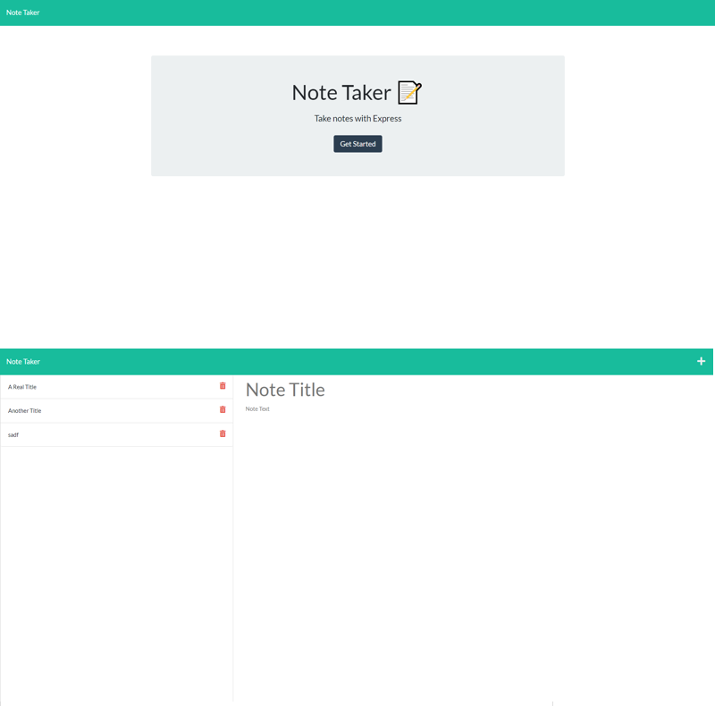

# Note Worthy JS
## An application by H0RSESH0E  
&nbsp;  
  
&nbsp;&nbsp;  
## Table of Contents
#### [Description](#description)  -  [Installation](#installation)  -  [Usage](#usage) - [License](#license) - [Contributing](#contributing) - [Tests](#tests) - [Questions](#questions)
&nbsp;  
## Description  
Note Worthy JS reads and writes notes in JSON format and serves them to a frontend using Express.js.  
&nbsp;  
    
     
&nbsp;  
## Installation
Clone the repo, initialize the same folder for npm packages and install the dependencies, then start the server with the command "node server" before opening http:\\localhost:3001 in your preferred browser. Or visit the application on the web at https://note-worthy-express.herokuapp.com/  
&nbsp;  
## Usage
The application is not yet functional online because the Heroku server has an "Ephemeral Disk" and files will not persist between browser sessions.  
&nbsp;  
## License  

**MIT License**  
A short and simple permissive license with conditions only requiring preservation of copyright and license notices. Licensed works, modifications, and larger works may be distributed under different terms and without source code.  
[View the full license here.](./LICENSE/license.txt)  
&nbsp;  
## Contributing
This project is not being maintained.  
&nbsp;  
## Tests
There is no testing regime applied to this application at this time.  
&nbsp;  
## Questions
Questions or concerns about the project or how to contribute to its development can be emailed to: **dcpb777@gmail.com**  
&nbsp;  
&nbsp;  
  
  
**[Visit me on GitHub](https://github.com/H0RSESH0E)**  
